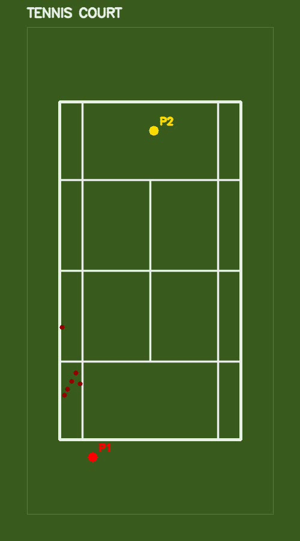
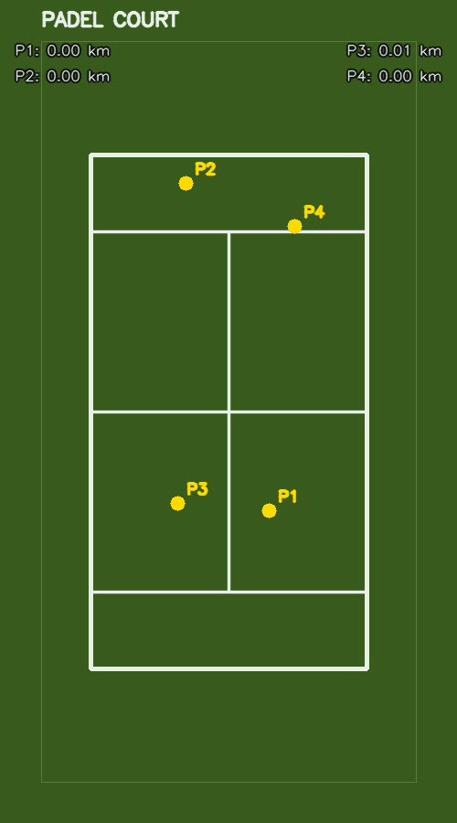
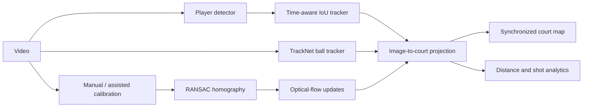

# CourtVision: Tennis and Padel Video Analytics

[](https://github.com/AbdelrahmanAhmed3/courtvision-racket-analytics/actions/workflows/ci.yml)

CourtVision is a computer-vision research prototype that turns a broadcast tennis or
padel video into tracked players, a TrackNet ball trajectory, and a synchronized
top-down court view. It combines learned detectors with classical geometry and makes
calibration quality visible instead of silently returning plausible-looking results.

The project was built as an end-to-end portfolio case study: model integration,
multi-object tracking, homography estimation, optical flow, temporal analytics,
interactive debugging, testing, and deployment-friendly command-line workflows.

| Tennis ball projection | Padel player distance |
| --- | --- |
|  |  |

> **Project status:** Manual calibration and court projection are the trusted baseline.
> Model-assisted calibration, ball-event detection, and shot-speed estimation are
> experimental and expose warnings or fallbacks when their inputs are unreliable.

## What It Demonstrates

- Local player detection with RF-DETR (no API key), with hosted Roboflow as an optional
  backend behind the same detector interface.
- Time-aware player identity persistence using IoU, spatial recovery, and a dormant
  track window.
- TrackNet integration for small, fast ball tracking on CPU, MPS, and CUDA.
- Manual, classical-CV, and model-assisted court calibration for tennis and padel.
- RANSAC homography validation with inlier and reprojection-error reporting.
- Sparse Lucas-Kanade optical flow for adapting calibration to camera movement.
- Court-space player distance, ball trajectories, and experimental shot analytics.
- A Streamlit interface for video selection, calibration, threshold tuning, and
  synchronized video/map playback.
- Unit tests for geometry, calibration, tracking, masks, analytics, and model-response
  conversion.

## Architecture



The calibration subsystem is deliberately hybrid. A human can click named court
landmarks for the most reliable result. Auto and assisted modes can instead combine
hosted keypoints with near-white line evidence, RANSAC-fitted intersections, and a
padel surface-color boundary. All modes produce the same named-landmark format, so
validation and projection do not depend on how the points were obtained.

## Capability Status

| Capability | Status | Notes |
| --- | --- | --- |
| Manual tennis/padel calibration | Validated baseline | Named points, RANSAC report, overlay |
| Player detection | Working | RF-DETR runs locally by default (~16 FPS on an Apple M4, see [reports/model_comparison.md](reports/model_comparison.md)); people off the court are dropped; hosted Roboflow is optional |
| Player tracking | Working | Simple time-aware IoU tracker is the current default |
| Ball tracking | Working with weights | TrackNet model is supplied separately |
| Player/ball court projection | Working | Ball projection assumes the ball lies on the court plane |
| Camera-motion compensation | Working with constraints | Optical flow; invalid frames are left unmapped |
| Keypoint-assisted calibration | Experimental | Hosted model; sensitive to domain shift and court visibility |
| Line-based (RANSAC) calibration | Experimental | Local; reliable on the near side, weak on the far side |
| Padel surface-colour corners | Experimental | Needs a model's corners as a seed; breaks with shadows and same-colour surroundings |
| Player distance | Working | Accumulated in calibrated court coordinates |
| Shot events and speed | Experimental | 2D video estimate, not radar-equivalent speed |

## Quick Start

Python 3.10 or newer is required.

```bash
python3 -m venv .venv
source .venv/bin/activate
python -m pip install --upgrade pip
pip install -e ".[dev,ui,local,media]"
```

The first run downloads the RF-DETR weights (about 390 MB for the default Small model, cached in
`~/.roboflow/models`). No API key is needed. Hosted Roboflow detection and the
keypoint-model calibration are optional: install the `roboflow` extra and put your
`ROBOFLOW_API_KEY` in `.env` (copy `.env.example`). Then start the local interface:

```bash
streamlit run app.py
```

The app writes generated artifacts under `outputs/ui_runs/`. Videos, model weights,
credentials, and generated outputs are intentionally excluded from Git.

### TrackNet Setup

Install PyTorch and place compatible TrackNet source and weights locally:

```bash
pip install -e ".[tracknet]"
```

The UI detects `tracknet-model/model_best.pt` when present. The CLI accepts explicit
source and weight paths:

```bash
python scripts/run_full_pipeline.py \
  --input data/raw/your_video.mp4 \
  --output-dir outputs/your_run \
  --calibration configs/calibrations/your_video.json \
  --draw-court-map \
  --tracknet-dir /path/to/TrackNet \
  --tracknet-model-path /path/to/model_best.pt
```

## Calibration Workflows

For a fixed or mildly moving camera, manual calibration is the dependable workflow:

```bash
python scripts/calibrate_court.py \
  --input data/raw/your_video.mp4 \
  --court-type tennis \
  --frame 90 \
  --output configs/calibrations/your_video_frame_90.json
```

Validate it by projecting the complete court model back onto the source frame:

```bash
python scripts/validate_calibration.py \
  --input data/raw/your_video.mp4 \
  --calibration configs/calibrations/your_video_frame_90.json \
  --output outputs/calibration/your_video_overlay.jpg
```

Enable **Adapt calibration to camera movement** in the UI, or pass
`--track-calibration` to the full pipeline. Sparse optical flow follows stable image
features from the calibrated frame, while RANSAC rejects inconsistent correspondences
before estimating each new homography. A cut or failed validation leaves that frame
unmapped rather than applying stale geometry.

Auto and assisted calibration are available in the UI as inspectable experiments.
Their debug views expose pixel masks, candidate lines, model points, refined points,
confidence, and threshold sensitivity so a failed proposal can be diagnosed.

## Running the Pipeline

Run detection, tracking, calibration, projection, and visualization together:

```bash
python scripts/run_full_pipeline.py \
  --input data/raw/your_video.mp4 \
  --output-dir outputs/your_run \
  --calibration configs/calibrations/your_video.json \
  --draw-court-map \
  --draw-calibration-overlay
```

To reproduce visualization without running detection again, provide saved detections:

```bash
python scripts/run_full_pipeline.py \
  --input data/raw/your_video.mp4 \
  --detections outputs/previous_run/detections.csv \
  --calibration configs/calibrations/your_video.json \
  --output-dir outputs/replay \
  --draw-court-map
```

This separation makes GPU/Kaggle inference and local analysis interoperable. Run
`python scripts/run_full_pipeline.py --help` for the complete set of options.

## Outputs

| Artifact | Purpose |
| --- | --- |
| `annotated.mp4` | Player IDs, ball trail, and calibration diagnostics |
| `court_map.mp4` | Standalone synchronized top-down view (`--draw-court-map`) |
| `court_map_annotated.mp4` | Broadcast and court map side by side |
| `detections.csv` | Detector output suitable for replay with `--detections` |
| `tracks_with_court_coords.csv` | Image, normalized, and metric court coordinates |
| `player_distances.csv` | Distance covered per player, in metres |
| `shots.csv` | Experimental shots with hitter, receiver, bounce frame, and court-plane speed (needs ball tracking) |
| `calibration.json` | Named landmarks and source metadata (written by `--create-calibration`) |

## Evaluation and Engineering Decisions

Saved manual-calibration examples currently report:

| Example | RANSAC inliers | Mean error | Max error |
| --- | ---: | ---: | ---: |
| US Open tennis, frame 90 | 8/8 | 1.31 px | 1.70 px |
| Qatar Major padel, frame 90 | 8/8 | 2.60 px | 3.43 px |

These numbers measure consistency with the selected landmarks, not accuracy against a
large labeled benchmark. A dataset-level evaluation is future work.

An experimental constant-velocity Kalman tracker with Hungarian assignment is kept in
the repository for comparison. On the tested padel clip it created more tracks and
potential ID switches than the simpler tracker. Court players move nonlinearly, are
frequently occluded, and can return far from a stale prediction, so the measured result
did not justify replacing the simpler default.

## Limitations

- A homography maps one plane. Airborne ball positions are projected as if they were on
  the floor, so they can be displaced on the map.
- Shot speed is a 2D court-space, contact-to-contact estimate. It is not racket-exit
  speed from radar and can be biased by missed ball frames or contact timing.
- Hosted keypoint models can shift under unseen camera angles, resolutions, lighting,
  glass reflections, and different court colors.
- Padel color refinement requires a visible court-floor boundary. Off-frame boundaries
  are rejected instead of invented.
- Classical pixel and line thresholds are inspectable but remain scene-sensitive.
- Optical flow can fail on broadcast cuts, heavy occlusion, blur, or parallax.
- The default player tracker has no appearance-based re-identification.
- Player detection runs offline, but ball tracking still depends on TrackNet weights
  supplied separately, and the pipeline is not yet real-time.
- Results have not yet been benchmarked across a diverse, labeled multi-camera dataset.

## Future Work

The plan lives in [docs/roadmap.md](docs/roadmap.md): v4.0 (Showcase edition: local
player detection, stable player identity, measured shots and rallies, movement stats),
v4.1 (trained court-keypoint and padel ball models, shot types) and v5.0 (Personal
edition with an LLM coaching report). Point outcomes, forced and unforced errors, wall
rebounds and 3D ball height are not planned yet. Design decisions are recorded in
[docs/adr/](docs/adr/) and domain terms in [CONTEXT.md](CONTEXT.md).

## Licence

CourtVision is licensed under the [GNU Affero General Public License v3.0](LICENSE); see
also [NOTICE](NOTICE). You may use, study and modify it, but if you distribute it or offer
it as a network service, your whole product must be released under the AGPL too.
Commercial licences without those obligations are available from the author
([ADR 0004](docs/adr/0004-agpl-with-commercial-licence.md)). Contributions need a
contributor licence agreement, so the project can keep offering both licences.

Only permissively licensed components may be bundled or downloaded by default
([ADR 0002](docs/adr/0002-permissive-licences-only.md)).

### Third-party components

Nothing below is bundled in this repository. Each keeps its own licence.

| Component | How it is used | Licence |
| --- | --- | --- |
| Python dependencies (NumPy, OpenCV, SciPy, pandas, and others) | Installed from PyPI | Their own permissive licences |
| [RF-DETR](https://github.com/roboflow/rf-detr) and its COCO weights (Nano, Small, Medium, Base) | Installed with the `local` extra; weights downloaded on first use | Apache-2.0 |
| [yastrebksv/TrackNet](https://github.com/yastrebksv/TrackNet) | Cloned at runtime for ball tracking; weights supplied by the user | **None published** (all rights reserved); to be replaced, see [docs/roadmap.md](docs/roadmap.md) |
| Roboflow hosted models (`tennis-v4d0h/2`, `padel-court-fmfv8/15`, `tennis-court-detection-onesd/10`) | Optional; called through Roboflow's API with your own key | Not verified |
| Match footage | Never committed; clips are linked and credited to their source | Owned by the broadcaster |

## Repository Layout

```text
app.py                    Streamlit calibration and analysis UI
src/courtvision/          Reusable detection, tracking, geometry, and analytics code
scripts/                  CLI pipelines and debugging tools
configs/                  Example configurations and saved calibrations
tests/                    Focused unit and integration-style tests
reports/                  Roadmaps, experiments, and failure analysis
docs/assets/              Repository-owned README visuals
data/ and outputs/        Local media and generated artifacts, ignored by Git
```

## Portfolio Summary

CourtVision demonstrates how learned models and classical computer vision can be
combined in a failure-aware video analytics system. Its strongest result is not a
single model score: it is the end-to-end engineering around coordinate systems,
temporal state, validation, fallbacks, reproducible artifacts, and honest uncertainty.

See [CHANGELOG.md](CHANGELOG.md) for release history and
[reports/court_calibration_roadmap.md](reports/court_calibration_roadmap.md) for the
calibration design history.
